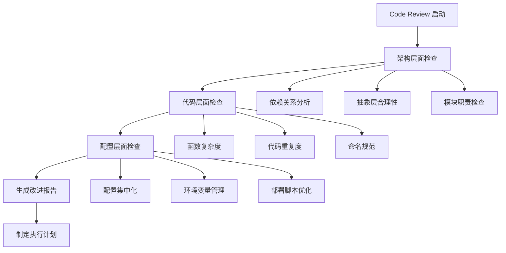

# Code Review 计划设计文档

## 概述

本设计文档基于 KISS 原则，为当前的 Code on Cloud 项目制定一个实用的 code review 计划。通过分析项目现状，我们发现项目整体架构相对简洁，但在某些方面存在可以进一步简化的空间。

## 架构

### 当前项目架构分析

项目采用了以下架构模式：
- **反向代理模式**：Nginx + Node.js + ttyd
- **插件化认证**：支持 SSO 和本地认证
- **容器化部署**：Docker + 脚本自动化

**优点**：
- 职责分离清晰
- 支持多种认证方式
- 部署自动化

**可简化点**：
- 认证提供者抽象层可能过度设计
- 会话管理逻辑较复杂
- 配置文件分散

### Review 架构设计



## 组件和接口

### 1. KISS 评估器 (KISSEvaluator)

负责根据预定义标准评估代码复杂度：

```javascript
class KISSEvaluator {
    // 评估函数复杂度
    evaluateFunctionComplexity(functionCode)
    
    // 评估抽象层合理性
    evaluateAbstractionLevel(moduleStructure)
    
    // 评估依赖关系
    evaluateDependencies(dependencyGraph)
}
```

### 2. Review 执行器 (ReviewExecutor)

按阶段执行 review 流程：

```javascript
class ReviewExecutor {
    // 执行架构检查
    executeArchitectureReview()
    
    // 执行代码检查
    executeCodeReview()
    
    // 执行配置检查
    executeConfigReview()
    
    // 生成报告
    generateReport()
}
```

### 3. 改进建议生成器 (ImprovementSuggester)

生成具体的改进建议：

```javascript
class ImprovementSuggester {
    // 生成重构建议
    generateRefactoringSuggestions(issues)
    
    // 生成简化建议
    generateSimplificationSuggestions(complexities)
    
    // 优先级排序
    prioritizeSuggestions(suggestions)
}
```

## 数据模型

### Review 结果模型

```javascript
{
    "reviewId": "string",
    "timestamp": "datetime",
    "projectInfo": {
        "name": "string",
        "version": "string",
        "language": "string"
    },
    "architectureScore": {
        "overall": "number (1-10)",
        "dependencies": "number",
        "abstraction": "number",
        "modularity": "number"
    },
    "codeScore": {
        "overall": "number (1-10)",
        "complexity": "number",
        "duplication": "number",
        "readability": "number"
    },
    "configScore": {
        "overall": "number (1-10)",
        "centralization": "number",
        "consistency": "number",
        "maintainability": "number"
    },
    "issues": [
        {
            "type": "string",
            "severity": "string",
            "location": "string",
            "description": "string",
            "suggestion": "string"
        }
    ],
    "improvements": [
        {
            "priority": "string",
            "category": "string",
            "description": "string",
            "effort": "string",
            "impact": "string"
        }
    ]
}
```

## 错误处理

### 1. 分析失败处理
- 文件读取失败时，跳过该文件并记录警告
- 语法解析失败时，使用文本分析作为降级方案
- 依赖分析失败时，提供手动检查建议

### 2. 报告生成失败处理
- 模板渲染失败时，生成简化版报告
- 数据不完整时，标记缺失部分并继续生成
- 输出文件写入失败时，提供控制台输出选项

## 测试策略

### 1. 单元测试
- 每个评估器组件的独立测试
- 边界条件和异常情况测试
- 模拟数据的准确性验证

### 2. 集成测试
- 完整 review 流程的端到端测试
- 不同项目类型的兼容性测试
- 报告生成的完整性测试

### 3. 实际项目测试
- 在当前项目上运行完整 review
- 验证建议的可行性和有效性
- 收集反馈并优化评估标准

## 针对当前项目的具体设计

### 1. 认证系统简化建议
- 合并 AuthManager 和 AuthProvider 的职责
- 简化会话管理逻辑
- 统一配置管理

### 2. 配置集中化设计
- 将分散的配置文件合并
- 使用单一配置源
- 简化环境变量管理

### 3. 部署脚本优化
- 合并功能重复的脚本
- 简化构建流程
- 减少配置文件数量